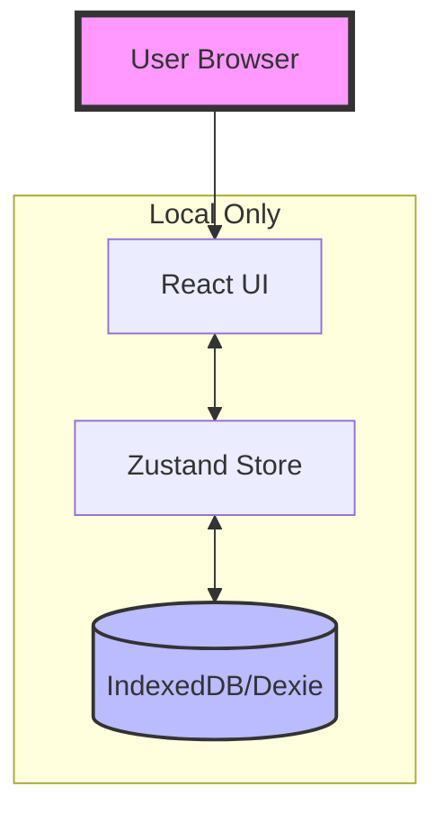
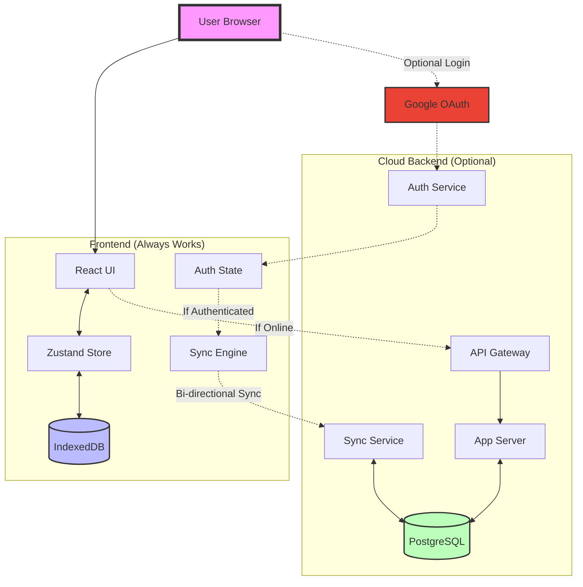
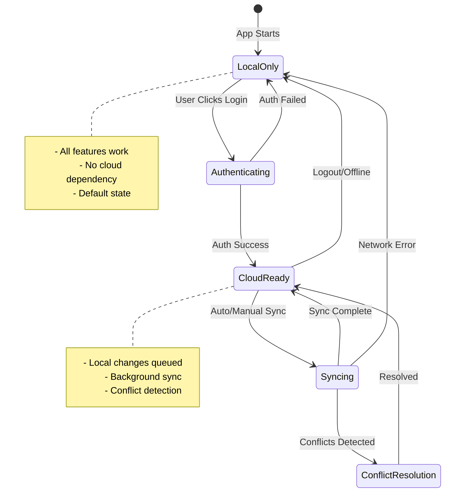
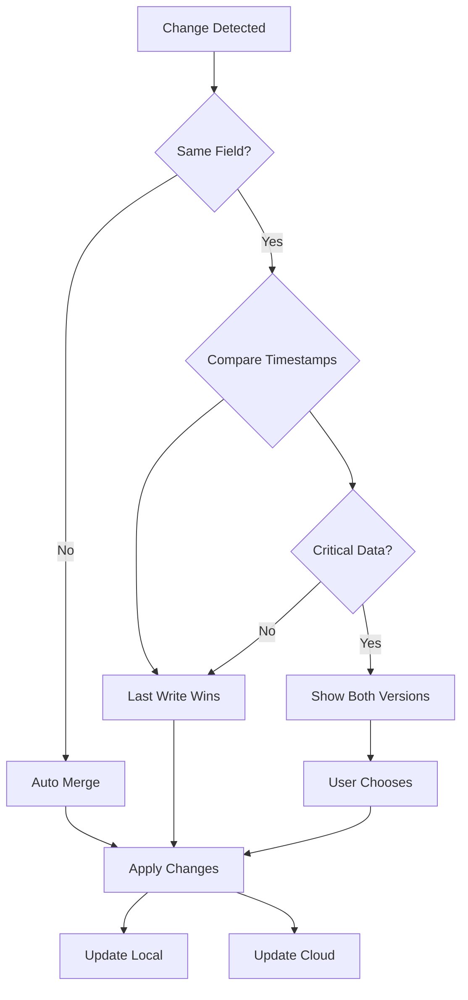
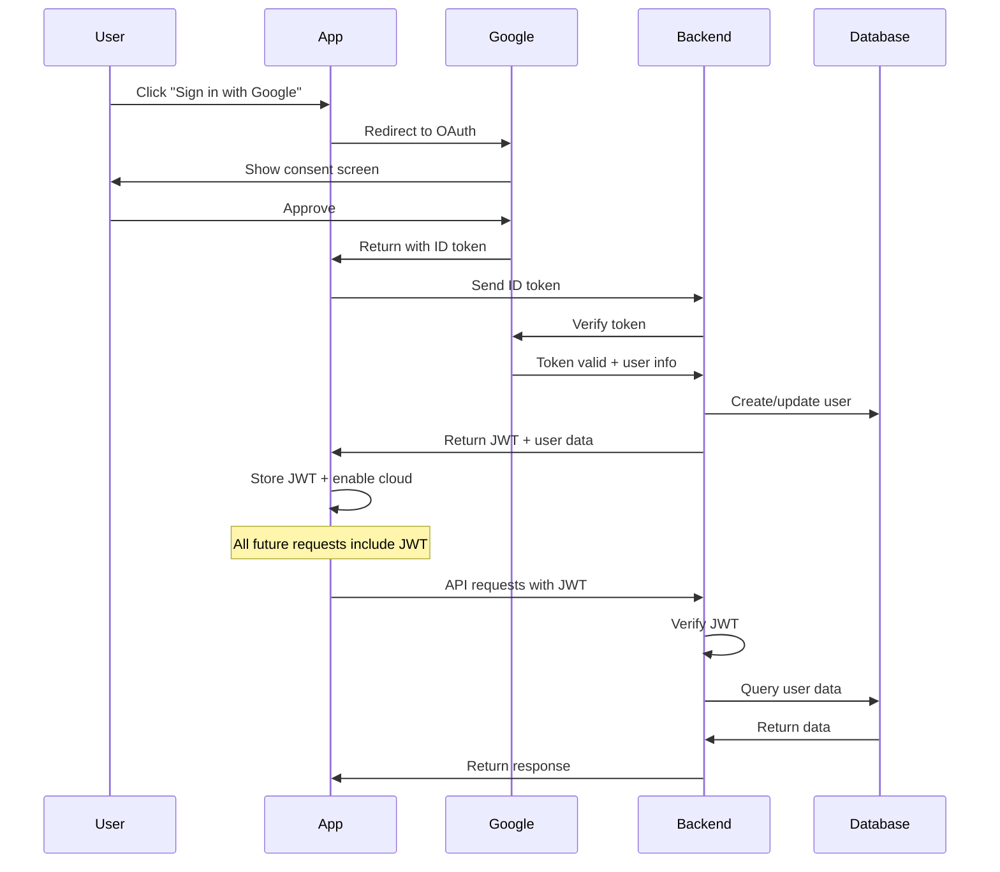
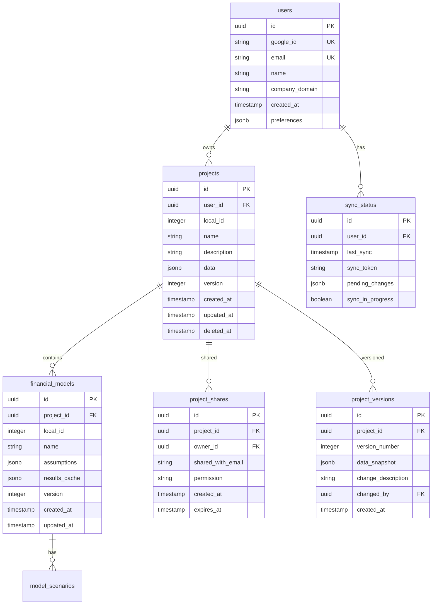
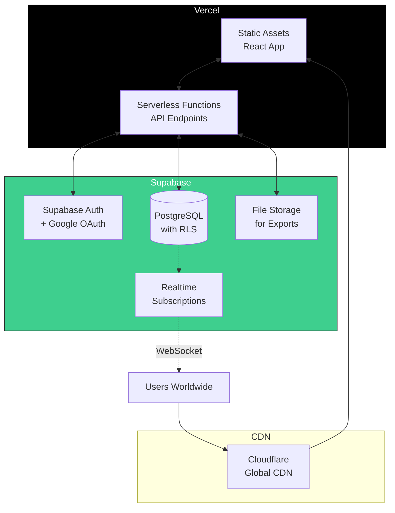
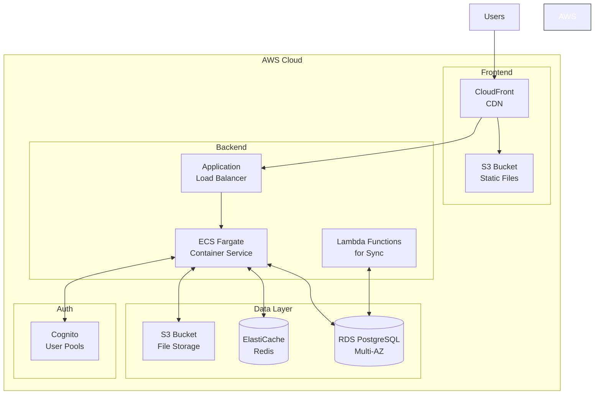

# Cloud Architecture Diagrams & Technical Details

## 🏗️ **System Architecture Evolution**

### **Phase 1: Current State (100% Local)**


### **Phase 2: Hybrid Architecture (Local + Optional Cloud)**


## 🔄 **Data Sync Flow**

### **Sync State Machine**


### **Conflict Resolution Strategy**


## 🔐 **Security Architecture**

### **Authentication Flow**


### **Data Access Control**
```sql
-- Row Level Security (RLS) in PostgreSQL
CREATE POLICY "Users can only see own projects"
ON projects FOR ALL
TO authenticated
USING (user_id = auth.uid());

CREATE POLICY "Users can see shared projects"
ON projects FOR SELECT
TO authenticated
USING (
    user_id = auth.uid() 
    OR 
    id IN (
        SELECT project_id FROM project_shares 
        WHERE shared_with_email = auth.email()
    )
);
```

## 💾 **Database Schema Design**

### **Complete ERD**


## 🚀 **Deployment Architecture**

### **Option 1: Vercel + Supabase (Recommended)**


### **Option 2: AWS Architecture**


## 📊 **Performance Considerations**

### **Caching Strategy**
```typescript
// Multi-layer caching
class CacheManager {
  // L1: In-memory cache (fastest)
  private memoryCache = new Map();
  
  // L2: IndexedDB cache (persistent)
  private localCache = db.cache;
  
  // L3: Redis cache (shared)
  private redisCache = redis.client;
  
  async get(key: string) {
    // Check L1
    if (this.memoryCache.has(key)) {
      return this.memoryCache.get(key);
    }
    
    // Check L2
    const local = await this.localCache.get(key);
    if (local && !this.isExpired(local)) {
      this.memoryCache.set(key, local.data);
      return local.data;
    }
    
    // Check L3 (if online)
    if (this.isOnline()) {
      const remote = await this.redisCache.get(key);
      if (remote) {
        await this.localCache.put({ key, data: remote });
        this.memoryCache.set(key, remote);
        return remote;
      }
    }
    
    return null;
  }
}
```

### **Sync Optimization**
```typescript
// Efficient delta sync
interface SyncDelta {
  added: any[];
  modified: any[];
  deleted: string[];
  lastSyncToken: string;
}

class DeltaSync {
  async prepareDelta(lastSyncTime: Date): Promise<SyncDelta> {
    const changes = await db.changes
      .where('timestamp')
      .above(lastSyncTime)
      .toArray();
    
    return {
      added: changes.filter(c => c.action === 'create'),
      modified: changes.filter(c => c.action === 'update'),
      deleted: changes.filter(c => c.action === 'delete').map(c => c.entityId),
      lastSyncToken: generateSyncToken()
    };
  }
}
```

## 🔍 **Monitoring & Observability**

### **Key Metrics to Track**
```typescript
// Client-side metrics
const metrics = {
  // Performance
  syncDuration: new Histogram('sync_duration_ms'),
  apiLatency: new Histogram('api_latency_ms'),
  cacheHitRate: new Counter('cache_hits'),
  
  // Reliability
  syncFailures: new Counter('sync_failures'),
  conflictCount: new Counter('sync_conflicts'),
  offlineTime: new Gauge('offline_duration_ms'),
  
  // Usage
  activeUsers: new Gauge('active_users'),
  projectsPerUser: new Histogram('projects_per_user'),
  cloudStorageBytes: new Gauge('cloud_storage_bytes')
};
```

### **Health Check Endpoints**
```typescript
// GET /health/detailed
{
  "status": "healthy",
  "timestamp": "2024-01-15T10:30:00Z",
  "components": {
    "database": {
      "status": "healthy",
      "latency_ms": 5,
      "connections": {
        "active": 10,
        "idle": 40,
        "max": 50
      }
    },
    "cache": {
      "status": "healthy",
      "hit_rate": 0.85,
      "memory_used_mb": 124
    },
    "sync": {
      "status": "healthy",
      "queue_length": 3,
      "last_sync": "2024-01-15T10:29:45Z"
    },
    "auth": {
      "status": "healthy",
      "provider": "google",
      "active_sessions": 245
    }
  }
}
```

## 🎯 **Success Metrics**

### **Migration Success Criteria**
1. **Zero Data Loss**: 100% of local data migrated successfully
2. **Performance**: Cloud sync < 2s for typical operations
3. **Reliability**: 99.9% uptime for cloud services
4. **Adoption**: 80% of users opt-in to cloud within 3 months
5. **Cost**: < $1 per user per month at scale

### **Rollback Triggers**
- Data loss incident
- Performance degradation > 50%
- Security vulnerability discovered
- User satisfaction drops below 70%
- Sync conflicts > 5% of operations

---

This architecture ensures a **safe, gradual migration** where every step is reversible and the local experience is never compromised.